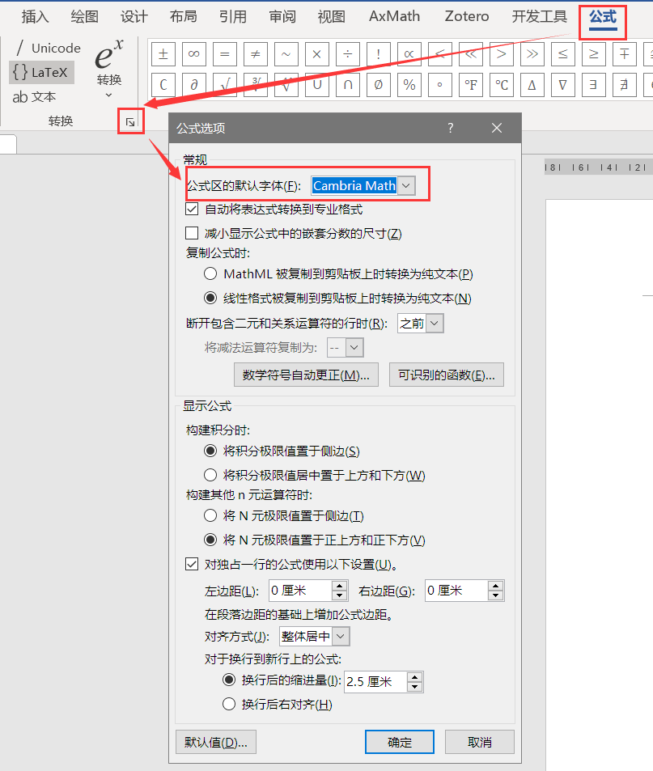
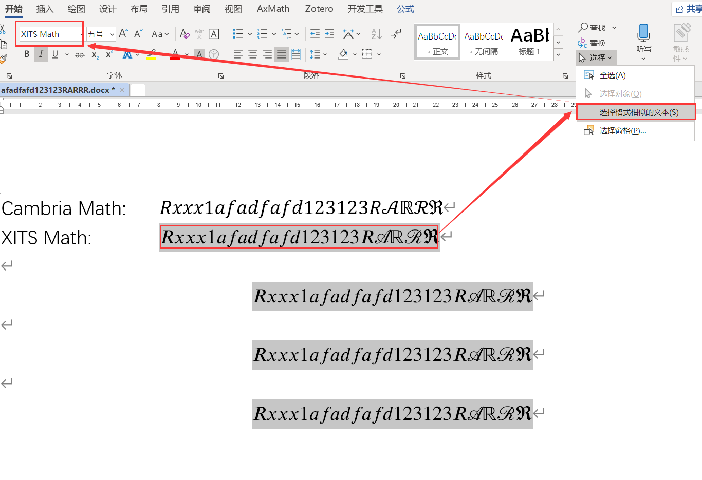

## 说明{-,--}

本文档是`重庆大学毕业论文Word模版`配套的排版指导，目的是：

- 给出用Word排版出一篇论文的具体操作步骤和模版的设计细节
- 使得对Word排版不熟悉的Word小白可以使用模版排版，提升排版能力
- 并作为示范，给出论文排版中的各种疑难杂症的解决方案

《排版指导》共分为两部分：

1. 排版思维：主要针对不具备基本排版思维的小白，普及排版相关的概念和思维
2. 具体实现：以重庆大学的毕业论文排版要求为基础，详细介绍各个部分的实现细节

## 请做好心理准备{-,--}

一篇论文所涉及到的内容非常之多，而且长度往往是几十页，无论是格式的多样性还是其长度所带来的工作量都是相当巨大的，因此其排版是一件相当复杂的事情，想要排版出一篇格式规范的论文需要消耗极大的精力，甚至需要一些强迫症和毅力才能够完成。

在排版的过程中，你不仅需要对每个单独元素的排版方法熟悉，还要对这些元素之间相互的组合或冲突这样的细节进行处理，可能需要对很多细节反复调整和确认，可能需要查阅很多资料来学习如何处理它们，通过了计算机二级考试这样的能力证明对这样成体系的大型项目并没有太大的作用。

因此，如果你希望完成一篇在排版上完美无缺的论文，请做好足够的心理准备，端正态度，不要抱有随便点几下或者临时抱佛脚轻轻松松两个小时这样的心态。

\newSection{}

\toc{目    录}

# 排版思维

## 什么是LaTeX

## 什么是markdown

## **从样式开始**

TODO 从格式刷引入

### 目录

### 样式的继承

## Word文档相关排版概念

Word中的内容结构大体可以分为如下的部分：

- 内容
  - 字&词
  - 行&行距
  - 段落&换行符
- 页面
  - 节&分节符
  - 分页符
  - 页眉页脚
- 特殊内容
  - 编号
  - 制表符
  - 图文混排

这里注意辨析`内容`和`页面`两个部分，`内容`即用户输入的字词句段这类传达意图的部分，而`页面`是所有和纸张相关的部分，比如按照某种页面尺寸，把`内容`截断形成“分页”，去掉这些`页面`相关的部分，对文档的“表意”并无影响，因此对`页面`和`内容`的处理可以是完全独立的

### 内容

#### 字&词

#### 行&行距

#### 段落&换行符

### 页面

#### 节&分节符

#### 分页符

#### 页眉页脚

### 特殊内容

#### 编号

#### 制表符

#### 图文混排

## 快速插入内容块

### 文档部件

### 自动更正

# 排版细节

## 封面

## 样式表（这里需要索引？）

## 编号

## 页眉页脚

### 断开链接

## 公式

### Word公式的基本概念

#### 几种插入公式的方式

##### 原生公式

###### 老式的“公式编辑器”

###### 新式的MATHML原生公式

##### 其他软件插入

###### AxMath

###### MathType

这里后面进针对新式的MATHML公式进行讨论。

#### Word原生公式的使用方法
### 公式编号

毫不客气的说，除了这里将会详细介绍的两种方法，网上其他能找到的所有关于公式编号的方法，全都是🌶🐤。

大部分的方法都是利用各种方法进行居中和右对齐（比如制表符甚至是空格），而后插入公式，再利用各种方式右对齐（丧心病狂者甚至连所谓`Ctrl` + `Alt` + `Enter`这样用做合并段落的奇葩快捷键都用上了），后使用域代码插入公式编号。

这些方法的通病在于，要么只能对老式的“公式编辑器”生效，要么就只能对“内嵌”的公式进行这样的对齐和编号，而无法用于“显示”公式。无法用于“显示”公式的后果就是上面提到的大型运算符无法正常显示。

#### Word原生方式

#### 表格法

### 快速插入公式

#### 快速插入--文档部件

### Word公式字体

Word中默认使用的公式字体为`Cambria Math`，有时候需要修改文档中使用的公式字体，可以单独选中每一个公式设置其字体，也可以在如图所示的选项中修改公式的默认字体

这时，如果你没有做过其他调整，会发现上图的公式字体下拉菜单中只有`Cambria Math`可以选择！

这是因为公式字体不同于一般的字体，需要有单独为公式设定的各种特殊尺寸和变形信息，而普通的字体并不具有这些信息，因而无法在公式中使用。有关信息可参考该网页：[https://answers.microsoft.com/zh-hans/msoffice/forum/all/office2013-word/c526f325-c776-4ac9-8e8f-d6fdfcc0cd27](https://answers.microsoft.com/zh-hans/msoffice/forum/all/office2013-word/c526f325-c776-4ac9-8e8f-d6fdfcc0cd27)

#### 使用其他公式字体

对于“公式也需使用Times New Roman”这样的要求，根据上文提供的解决方案，可以使用按照“罗马字体”设计的公式字体`XITS Math`，可到[https://github.com/alif-type/xits](https://github.com/alif-type/xits)下载使用。

**但是！**`.otf`格式的字体无法被嵌入到PDF文档中[^eq-font]，如果使用Word自带的“导出”功能生成PDF，公式字体将会变成位图，在放大之后会失真出现锯齿边缘！这一问题可以使用Word中的“打印”功能解决，即，使用打印功能生成的PDF放大后不会出现失真，Word在打印功能中将公式字体转换成了矢量图形（SVG），虽然不会失真，但是字体仍然无法复制。

TODO 图片

[^eq-font]:如果在Word中使用了不常见的字体，Word默认会把这个字体使用到的部分嵌入到文档中，使得文档在其他设备上也能正常显示原有字体的效果。但是对PDF而言，只能嵌入格式为`.ttf`字体

**万幸**，好心人把常用的数学字体给整理了出来，并把`.otf`格式的字体转化为了`.ttf`格式，这样也就可以被Word正常嵌入了，见[https://gitee.com/cyano/OpenType-MATH-TTF](https://gitee.com/cyano/OpenType-MATH-TTF)，在`font`文件夹内下载对应的字体后

右键选择“为所有用户安装”，安装完毕即可在Word中设置默认公式字体或单独切换具体公式的字体

  

#### 批量修改已存在公式的字体

上述修改默认公式字体的方法只能针对新创建的公式，并不会自动修改已经创建好的公式的字体。

可以将光标放置于其中一个想要修改字体的公式上，使用“开始”选项卡中的“选择格式相似的文本”功能选中所有这类字体的公式，而后更改字体即可

  
